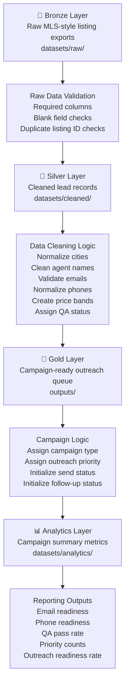
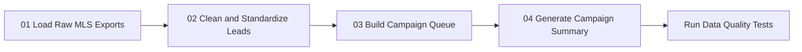
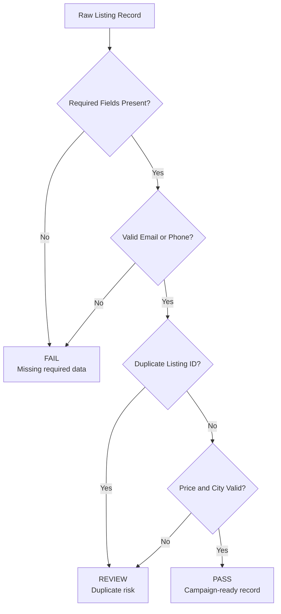
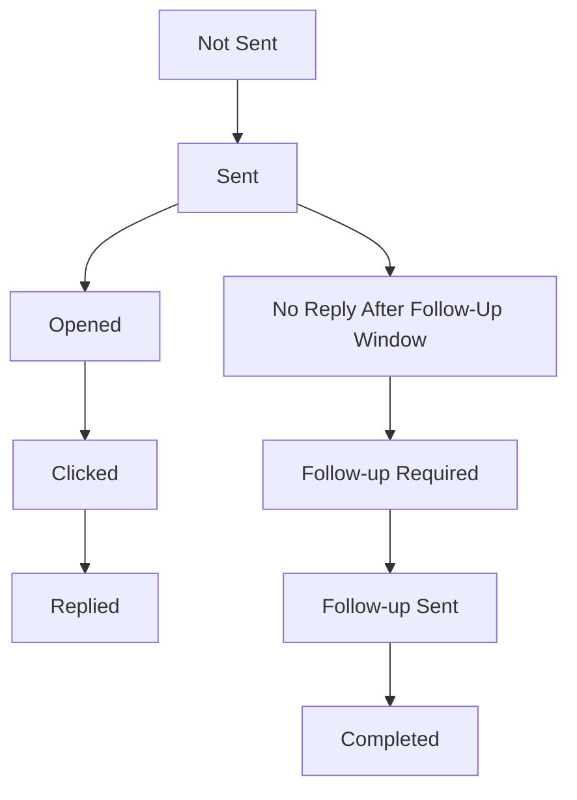

# 🧭 Project Architecture Diagram

## Overview

This diagram shows how the **Luxury Rental Lead Pipeline & MLS Outreach Automation System** moves data from raw MLS-style listing files into cleaned lead records, campaign-ready outreach queues, and analytics outputs.

All data represented in this project is synthetic and public-safe.

---

## 🏗️ End-to-End Architecture

---

## 🔄 Pipeline Execution Order

---

## 🧪 QA Workflow

---

## 📬 Outreach Tracking Workflow

---

## 📌 Architecture Summary

| Layer     | Main Purpose                                             | Output                    |
| --------- | -------------------------------------------------------- | ------------------------- |
| Bronze    | Validate raw synthetic listing files                     | Raw data profile          |
| Silver    | Clean and standardize listing, agent, and contact fields | Cleaned lead records      |
| Gold      | Build campaign-ready outreach queue                      | Prioritized outreach file |
| Analytics | Summarize readiness and performance metrics              | Campaign summary          |
| Tests     | Validate output quality                                  | QA test results           |

---

## 🔒 Confidentiality Note

This architecture is a public-safe reconstruction. It does not include real company files, MLS exports, agent contact data, property addresses, internal Google Sheets, internal email messages, deployment links, tracking URLs, or screenshots from private systems.
